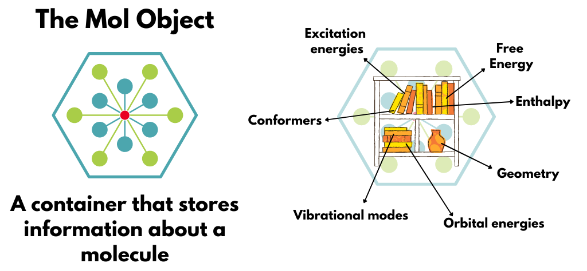
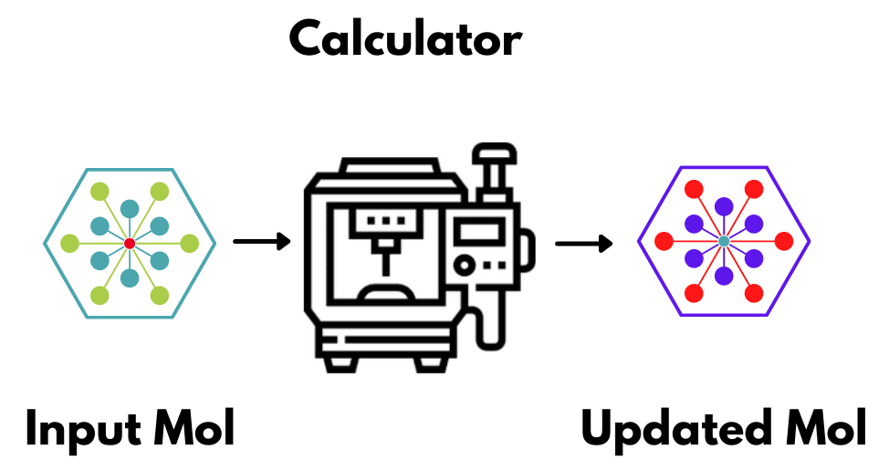
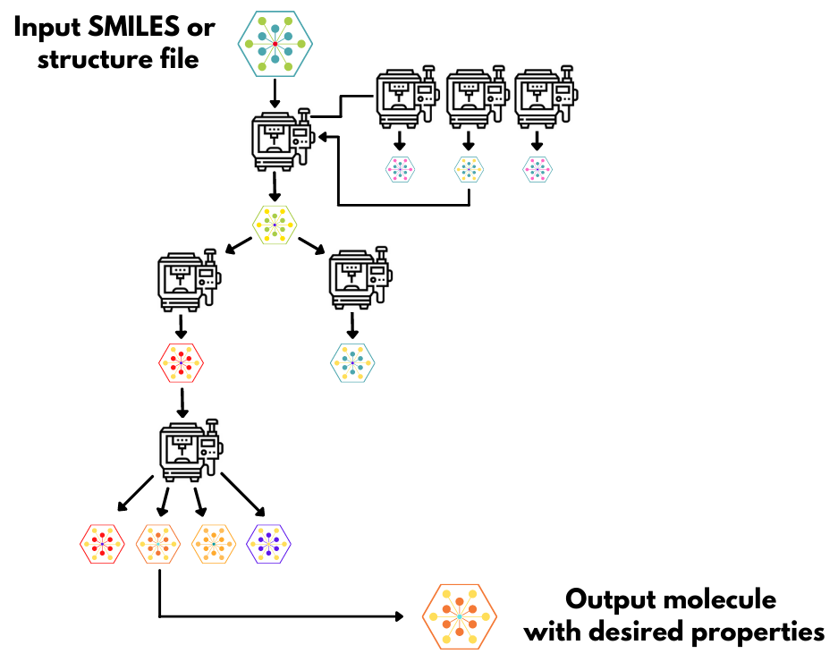

# workflow2.0

A package for automating QM calculation workflows

Inspired by RDkit and the Atomic Simulation Environment's design principles\
but adapted for HPC job scheduler environment

More here soon!

## The Mol Object
The central piece to this package is the **Mol Object**. 

The Mol Object stores all of the 3D information, propreties, conformers, energies, tags, etc for a molecule. The central theme of this codebase is manipulating these Mol Objects with calculators that will modify the Mol Object in some way. The Mol Object can be passed to a calculator, which will return an updated Mol Object. 

## Calculators
Submit some kind of calculation to update the Mol Object

For example, creating a Gaussian calculator to optimize the input Mol Object would return a Mol Object with updated coordinates, energies, orbital energies, vibrational modes, etc. 

## Creating Workflows
This code is designed to build quantum chemistry workflows.

<table>
<col style="width:50%">
<col style="width:50%">
<thead>
<tr>
<td style="text-align: left; vertical-align:top;"> 
 The power of this codebase is not for individual   calculations.  Often those are easy enough to set up and  manage by hand.  Rather, it's power is in the ability to script together complex  workflows, passing the Mol Object form one calculator to the  next, automating many calculations. 
 By building out functionality from the central Mol Object, everything will connect nicely together and allow much more flexibility when designing automated pipelines compared to stringing together sbatch scripts and hoping for the best. </td>
<td>  </td>
</tr>
</thead>
</table>

